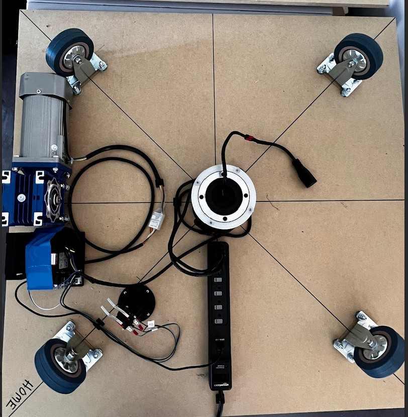
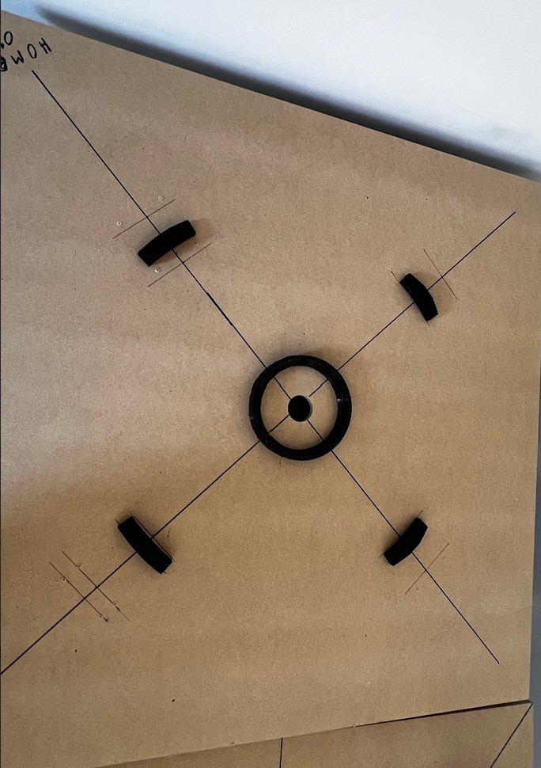
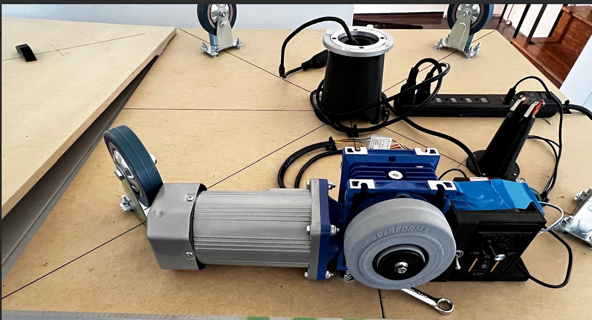
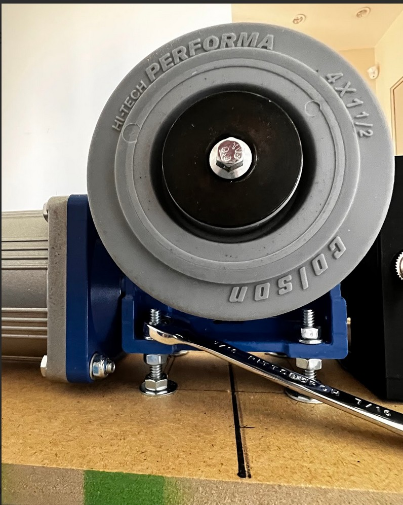
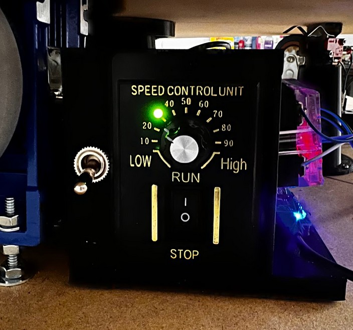
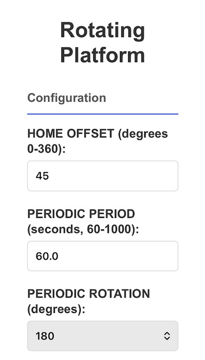
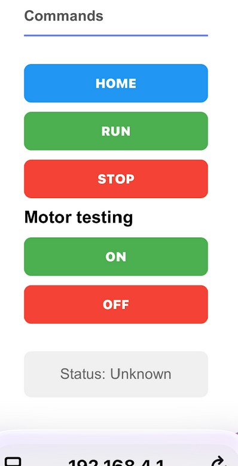

# Platform control

The platform creates a wifi signal that needs to be connected to: 
SSID: "tech" PASSWORD: "Art723!!" 
Use a web browser to connect to "htpp://192.168.4.1" 
Configure the HOME offset degrees and periodic rotation period and degrees of rotation. 
 
The platform must be put in the "HOME" position by pressing the "HOME" button which points in the same direction each time after the homeing sequence completes. The homing sequence rotates 1 or 2 times before stopping. 
After the homeing is complete the "RUN" button starts the periodic rotations. The platform rotates the amount set by the periodic rotation amount and stops until the the next rotation starts. The rotations occur an the precise intervlas set by the periodic period. 

# Platform views

View of the bottom panel of the platform from the top. The housing in the center send the AC power to the top using a rotary coupler and has a 6" bearing on its top which fits into the ring on the bottom panel. There are 4 caster wheels and a large motor with a drive wheel which causes the top panel to rotate. Next to the motor is the motor controller. The limit switches are mounted so that the humps on the top panel activate them as the pass over the switch.  
  
View of the top panel of the platform from the bottom. The center ring is used to keep the top panel centered using the bearing on the bottom panel. There are 4 humps which activate the limit switches on the bottom panel.  
  
View of the bottom panel of the platform from the side.
  
The height of the drive wheel cn be adjusted using the bolt nuts to raise the motor. The bolt threads provide  fine resolution in height adjustment.
  
View of the motor controller. The rotation rate is controlled by the SPEED knob. The switch to the left controlls CW and CCW platform rotation. The microcontroller on the right side (blue light) has the wifi interface and performs the periodic rotations by turning the motor ON/OFF.
  
Top of the webpage which has the configuration.
  
Bottom of the webpage which has the control buttons.
  

# Micro-controller

  
  